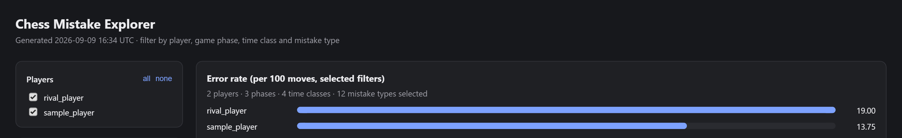

# Chess Error Tracker

[](https://github.com/vincvloo/Chess-Error-Tracker/actions/workflows/ci.yml)
[](LICENSE)
[](pyproject.toml)

Finds the mistakes you keep making, not the ones you made yesterday.

Per-game review tells you what went wrong in that game. This tells you what goes
wrong in your chess. It pulls your Chess.com history, runs Stockfish over every
position where it was your move, classifies each significant error, and keeps
everything in a local database so the picture sharpens each time you run it.



*Preview from `--export-html`, shown here with made-up sample data rather than
a real account.*

---

## Quick install

One script does the whole setup (Python environment, the app, Stockfish) and then
starts the web app. Running it again later just starts the app.

- **Windows:** double-click `install.cmd`, or run `powershell -ExecutionPolicy Bypass -File install.ps1`
- **macOS / Linux:** `bash install.sh`

It needs Python 3.10 or newer already installed. Add `-NoLaunch` (Windows) or
`--no-launch` (macOS / Linux) to set things up without starting the app. Prefer to
do it by hand? The steps below are exactly what the script does.

## Setup (Windows)

**1. Create an environment and install the tool**

```
py -m venv %USERPROFILE%\.venvs\chess
%USERPROFILE%\.venvs\chess\Scripts\activate
pip install -e .
```

In PowerShell the activation line is `.\.venvs\chess\Scripts\Activate.ps1`. If
that is blocked, run `Set-ExecutionPolicy -Scope CurrentUser RemoteSigned` once,
or just use `cmd`.

**2. Install Stockfish**

```
winget install Stockfish
```

Or download the Windows AVX2 build from stockfishchess.org and unzip it to
`C:\Tools\stockfish\`. Either works. The tool finds it automatically.

**3. Find your Chess.com username**

Not your Google email. It is the last part of your profile URL,
`chess.com/member/YOUR_USERNAME`, or in Settings under your account. Signing in
with Google makes no difference to any of this, since the API is unauthenticated
and keyed only on the username.

### Setup on macOS or Linux

```
python3 -m venv ~/.venvs/chess
source ~/.venvs/chess/bin/activate
pip install -e .

brew install stockfish        # macOS
sudo apt install stockfish    # Debian and Ubuntu
```

---

## First run

```
chess-tracker --user YOURNAME --email you@example.com
```

The email goes into the User-Agent header. Chess.com requires a contact address
there and returns 403 without one. It is not a login and is never sent anywhere
else.

Start narrow rather than analysing years of history on the first attempt:

```
chess-tracker --user YOURNAME --email you@example.com ^
    --since 2026-01 --time-class blitz --limit 50
```

Expect roughly 20 to 40 seconds per game at the default depth of 14. Fifty games
is about half an hour. You can interrupt with Ctrl+C at any point and everything
already analysed stays saved.

## Everyday use

```
chess-tracker --user YOURNAME --email you@example.com
```

Same command every time. Only games it has never seen get analysed. Two HTTP
requests, then whatever new games you have played.

Reading the report without touching the network or the engine is instant:

```
chess-tracker --user YOURNAME --report-only
chess-tracker --user YOURNAME --report-only --last-days 90
```

---

## Web app

Prefer clicking over typing flags? There's a local web app: pick or add users,
set fetch criteria in a form, watch analysis progress live, and browse the
same interactive dashboard from a browser window instead of an exported file.
Runs entirely on your own machine against your own database -- no hosted
server, no account, nothing leaves your computer except the same Chess.com API
calls the CLI already makes.

```
pip install -e ".[web]"
chess-tracker serve
```

Opens a browser window pointed at the app (in "app mode" -- no address bar --
if Chrome or Edge is found, a normal tab otherwise). Add `--no-browser` to
just start the server and open the URL yourself, or `--port` if 8000 is
already taken. `--db` and `--engine` work the same as the CLI's flags.

This is a genuinely separate install: the plain `pip install -e .` from setup
stays exactly as light as it always was. The web app is additional, not a
replacement -- everything above still works exactly as documented.

### What's in the web app

From the home page (once you've set which tracked player is "you"):

| Page | What it does |
|---|---|
| **Practice** | Replays your own stored mistakes on an interactive board. Pick a category, try the move again, ask for a hint, and see whether the engine agrees ("also fine" counts). After a miss, the best move is drawn on the board (green, yours in red or amber) with a one-line reminder of what went wrong in your game. You can extend a queue with other tracked players' mistakes. |
| **Play** | A full game against Stockfish or Maia at a chosen strength, optionally steered toward the game phase you struggle in. "Coach me as I play" (on by default) rates each of your moves as you make it (best / good / inaccuracy / mistake / blunder), shows the engine's best move and what kind of mistake it was, and lets you take a move back and try again, optionally with the best move drawn as an arrow. "Analyze this game" scores the finished game with the same logic as your real games, and you can click any flagged move to see the position. A game where you took moves back doesn't change your skill rating. Bot games are never stored. |
| **Puzzles** | Lichess puzzles from a local, filtered copy of their public database (CC0). Filter by rating and theme, and use "Get more puzzles" to top up. A wrong answer shows the right move as an arrow. |
| **Daily puzzle** | One puzzle per day (UTC), the same for everyone on this machine. |
| **Puzzle rush** | Solve as many puzzles as you can in 3 minutes. Only the final score is saved. |
| **Achievements** | Streak, skill rating, badges, rating by theme, how each mistake category has moved over time, and your practice history. |
| **Leaderboard** | Every tracked player on this machine who has any activity, side by side. Purely local. |
| **Dashboard** | The interactive dashboard, live, with a severity filter. |

### Streaks, ratings and badges

Practising or solving a puzzle keeps a **daily streak** going. You get one automatic
**streak freeze** per week, which bridges a single missed day. Days are counted in UTC.

Your **skill rating** has an overall number and a number per theme (fork, pin, endgame, ...):

- **Puzzles** move it live, Elo-style: beating a harder puzzle moves it more. A puzzle tagged
  "fork pin" updates your overall, fork and pin ratings.
- **Your analysed games** move it based on how cleanly you played (average centipawn loss per
  move), not on whether you won. They feed the overall rating and the opening / middlegame /
  endgame ratings. Tactical themes stay puzzle-only.
- **Bot games** move it once, when you press "Analyze this game".

The game part is a heuristic estimate, not a true Elo. It is rebuilt from scratch in date order
after every analysis run, so fetching old games or re-analysing can't skew it. The puzzle and game
halves are only blended when displayed. On the Puzzles page the rating range is pre-filled from
your skill rating; whatever you type in still wins.

**Badges** (streak lengths, puzzles solved, hint-free practice, rating milestones) are awarded when
you earn them and kept permanently. Attempts made before badges existed still count.

---

## Options

| Flag | Purpose |
|---|---|
| `--user` | Chess.com username. Comma-separate for several: `--user me,rival1`. Required. |
| `--list-users` | Show every user in the database with sample size and error rate, then exit. |
| `--compare` | Side-by-side comparison instead of per-user reports. Needs two or more users. |
| `--email` | Contact address for the User-Agent. Required unless `--report-only`. |
| `--db` | Database location. Defaults to `chess_tracker.db` next to the script. |
| `--engine` | Path to Stockfish. Auto-detected if omitted. |
| `--depth` | Search depth. Default 14. See below. |
| `--since` | Earliest month, format `YYYY-MM`. |
| `--time-class` | `bullet`, `blitz`, `rapid` or `daily`. |
| `--limit` | Cap on new games analysed this run. |
| `--min-loss` | Centipawn loss before a move counts as an error. Default 50. |
| `--threads` | Engine threads. Default 2. |
| `--pause` | Seconds between HTTP requests. Default 0.6. |
| `--report-only` | Report from the database. No network, no engine. |
| `--last-days` | Restrict the report to recent games. |
| `--export` | Write all stored mistakes to a CSV. |
| `--export-html` | Write an interactive, filterable dashboard to this HTML file. Report-only, no network. |
| `--config` | Path to a JSON file of defaults for the options above. See below. |
| `--quiet` | Suppress routine progress messages; warnings and errors still show. |
| `--verbose` | Show extra detail, including every HTTP request made. |

### Config file

If you always pass the same `--email`, `--depth`, `--threads` etc., put them
in a JSON file instead of retyping them every run. By default the tool looks
for `~/.chess-tracker.json`; pass `--config path/to/file.json` to use a
different one.

```json
{
  "email": "you@example.com",
  "depth": 18,
  "threads": 4,
  "pause": 0.8
}
```

Any of `email`, `db`, `engine`, `depth`, `threads`, `pause`, `min_loss`,
`time_class` can go in the file. A flag passed on the command line always
wins over the config file, which always wins over the built-in default.
`--user` is deliberately not configurable this way -- it stays a required,
per-run flag.

### Choosing a depth

Depth 12 is fast and fine for spotting hung pieces. Depth 14 is the default and
the right trade-off for most purposes. Depth 18 or 20 is slower by several times
and only worth it if you are studying specific positions closely.

You can deepen later without losing anything. Re-running with a higher `--depth`
re-analyses the affected games and cleanly replaces the old rows.

### Where the engine is found

In order: the `CHESS_ENGINE` environment variable, then `PATH`, then the standard
install locations for your platform. To pin it permanently:

```
setx CHESS_ENGINE "C:\Tools\stockfish\stockfish-windows-x86-64-avx2.exe"
```

The script prints which binary it selected on each run.

---

## Reading the report

**Recurring error types.** The ranked list of what actually goes wrong. This is
the section that should change how you train. If "left a piece undefended" is
40% of your serious errors, no amount of opening study will help you.

**When they happen.** Split by phase and by move number. Errors clustered in
moves 1 to 10 point at opening preparation. Errors after move 30 usually point
at fatigue or the clock, not knowledge.

**Time pressure.** Errors bucketed by seconds remaining. If most of your damage
lands under 30 seconds, the problem is time management. Tactics puzzles will not
fix it. The report says so explicitly when that threshold is crossed.

**Trend.** Serious errors per 100 moves by month, plus a comparison of the first
half of the period against the second half, broken down by category. This is the
reason the database exists. It shows which weakness is genuinely shrinking and
which one is stuck, which a single run cannot tell you.

**By colour and time control.** A meaningful gap between white and black is a
repertoire problem. A meaningful gap between blitz and rapid is a speed problem.

**Openings you play often.** ECO codes with three or more games, ranked by
serious errors per game.

**Top 10 positions to review.** The biggest evaluation swings, with the move you
played, the engine's choice, your clock at that moment, and a link to the game.

---

## The data

Everything lives in one SQLite file, `chess_tracker.db` next to the script by default.

| Table | Contents |
|---|---|
| `games` | One row per analysed game **per tracked user**, keyed on (url, username). |
| `mistakes` | One row per error: move number, category, severity, centipawn loss, clock, FEN. |
| `archives` | Raw monthly PGN payloads as fetched. |
| `runs` | Audit log of every run: timestamp, requests made, games added. |
| `settings` | Web app only: which player is "you", plus fetch settings. The CLI's own config file is separate. |
| `practice_attempts` | One row per practice-mode move attempt. |
| `puzzles`, `puzzle_source_stats` | The locally imported Lichess puzzles, and counts of how many exist in the full database. |
| `puzzle_attempts` | One row per finished puzzle (solved or failed). |
| `user_streaks` | Current and best streak, and the streak freeze. |
| `user_puzzle_ratings` | Puzzle-derived rating, overall (empty theme) and per theme. |
| `user_game_ratings` | Game-derived rating, overall and per phase. Rebuilt after each analysis run. |
| `badges_earned` | Which badges each player has earned, and when. |
| `daily_puzzles` | Today's (and past days') daily puzzle. |
| `puzzle_rush_scores` | Final score of each puzzle rush. |

Everything is scoped by username, so one database can hold any number of people
without their data mixing.

The FEN column means every stored mistake can be pasted straight into a board.
Any SQL client will open the file, so you are not limited to the built-in report:

```sql
-- your worst categories under time pressure
SELECT category, COUNT(*) FROM mistakes
WHERE username = 'yourname' AND clock_seconds < 30
GROUP BY category ORDER BY 2 DESC;

-- one category across everyone you track
SELECT username, COUNT(*) FROM mistakes
WHERE category = 'left a piece undefended' AND severity = 'blunder'
GROUP BY username;
```

`--export mistakes.csv` dumps the same data for a spreadsheet, covering every
user named in `--user`.

One caution on Windows: if your user folder is redirected to OneDrive, put the
database somewhere local with `--db`. SQLite and cloud sync do not mix.

---

## API safety

Your Chess.com account is never at risk, because the script never authenticates.
This is the public Published-Data API: read-only, no key, no login. Chess.com
cannot tie a public data request to your playing account.

Their stated policy is that serial access is unlimited and that parallel requests
are what trigger a 429. Abnormal traffic can get an application blocked, which is
why the contact email matters: with a recognisable User-Agent they will try to
reach you before blocking anything. That block would apply to the client, not
your account.

The script is built to stay far below any threshold:

- Strictly serial, one request at a time, with a pause between them
- Past monthly archives are stored permanently and never requested again
- The current month is revalidated with an ETag, so an unchanged month costs a
  304 with no payload
- A 429 triggers exponential backoff and honours `Retry-After`

In practice the first run makes one request per month of your history. Every run
after that makes two.

### Tracking several people

`--user` takes a comma-separated list. Each person is fetched and analysed in
turn, in one pass, sharing a single engine process:

```
chess-tracker --user me,rival1,rival2 --email you@example.com
```

Run the same command again later and each person gets only their own new games.
Nothing is re-analysed, and one person's history is never mixed into another's.

A game between two tracked people is stored once for each of them, scored from
each player's own side of the board. Their mistakes stay separate.

To see who is in the database and whether each sample is large enough to trust:

```
chess-tracker --user me --list-users
```

Every report is already per user. With several names, you get one report each:

```
chess-tracker --user me,rival1 --report-only
```

### Comparing

```
chess-tracker --user me,rival1,rival2 --report-only --compare
```

Rates are per 100 of that player's own moves, so unequal sample sizes stay
comparable. Categories are ordered by the size of the gap between players, and
the footer names the three where the first user in the list loses the most
ground.

Read the gaps, not the total. Two players with the same overall error rate can
have completely different problems, and that difference is the whole point of
running this against someone stronger. The useful hypothesis to test is that a
stronger player makes a similar number of errors but far fewer catastrophic
ones, which turns "make fewer mistakes" into "stop making the expensive ones".

Filters apply to comparisons too, and comparing like with like matters:

```
chess-tracker --user me,rival1 --report-only --compare --time-class blitz
```

Public and reasonable to use are not the same thing. Benchmarking against a few
stronger players is fine. Publishing a named person's weakness profile, sending
it to them unsolicited, or pointing this at hundreds of accounts is not.

---

## Troubleshooting

**403 from Chess.com.** The User-Agent was rejected. Pass a real address in
`--email`.

**404, no such user.** Wrong username. Check the end of your profile URL. A
closed or restricted profile can also produce this.

**Stockfish not found.** Pass `--engine` with the full path or set
`CHESS_ENGINE`. The error message lists install commands per platform.

**`pip install chess` grabbed the wrong package.** There is an abandoned package
of a similar name on PyPI. Inside the virtual environment this costs nothing to
fix: `pip uninstall chess` then `pip install chess` again, and verify with
`python -c "import chess; print(chess.__version__)"`. It should be 1.11 or later.

**Analysis is too slow.** Lower `--depth` to 12, raise `--threads`, and use
`--limit` to work through your history in batches. Progress is saved per game.

**429 responses.** The script backs off on its own. If it keeps happening, raise
`--pause`.

---

## Limitations worth knowing

The classifier is a set of heuristics on top of engine output. "Positional or
planning error" is partly a catch-all for mistakes it could not name specifically.
Treat the named categories as reliable and that one as a residual.

Blame attribution is imperfect. When a bad plan takes three moves to go wrong,
the engine often flags the last move in the sequence rather than the first one.

Sample size matters. Fifty games is enough to see your top two or three error
types. It is not enough to trust the opening breakdown or small differences
between categories. Those need a few hundred games, which is what the persistent
database is for.

Finally, the engine's judgement is not a training plan. Stockfish will tell you a
move loses 60 centipawns. It will not tell you that at your level that mistake is
irrelevant compared with the piece you hung on move 12. Read the frequency
rankings, act on the top two, ignore the rest.

---

## Architecture

The code is a small package, `chess_tracker/`, split along its natural seams:

| Module | Responsibility |
|---|---|
| `engine.py` | Locates a Stockfish binary on the current platform. |
| `db.py` | The SQLite schema and saving/loading data. |
| `chesscom.py` | The Chess.com API client: serial, cached, conditional requests. |
| `analysis.py` | Stockfish analysis and mistake classification. |
| `analysis_runner.py` | Orchestrates a fetch+analyse run; shared by the CLI and the web app's background jobs. |
| `reports.py` | Text reports and player comparisons, straight from the database. |
| `html_export.py` | The interactive HTML dashboard, shown live in the web app or exported to a file. |
| `bot.py` | Play mode's opponent: move choice at a target Elo, including weakened play below each engine's calibrated floor. |
| `puzzles.py` | The Lichess puzzle database: CSV import, random pick, answer checking. |
| `gamification.py` | Streaks, puzzle and game skill ratings, badges, daily puzzle, puzzle rush and the leaderboard. |
| `cli.py` | Argument parsing and orchestration (the `chess-tracker` entry point; dispatches to `web/` for `serve`). |
| `web/` | The local web app (`chess-tracker serve`): its pages and API, the background jobs that fetch and analyse games or import puzzles, and the HTML templates. One shared chessboard template is used by Practice, Play and Puzzles. |

## Running the tests

```
pip install -e ".[dev,web]"
pytest
```

The suite covers the pure logic -- mistake classification, phase detection,
schema and persistence round trips, report query building -- the Chess.com
client's error handling with `requests` mocked, and the web app's job manager
and routes with FastAPI's `TestClient`. It needs neither Stockfish nor network
access. CI runs it on every push and pull request. Install both extras
together as shown above -- `test_jobs.py`/`test_web_routes.py` import FastAPI
at module level, so they fail to even collect without the `web` extra.
